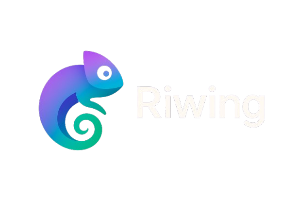

 
[📥 Download](https://github.com/sudohorus/Riwing/releases/latest) • [🚀 Recursos](#recursos)

---

## 🌟 Sobre o Projeto

**Riwing** é uma ferramenta poderosa de personalização e produtividade que transforma a experiência do seu desktop. Inicialmente focado no Windows, oferece uma interface elegante e funcional para organizar e otimizar seu ambiente de trabalho.

  <strong>Feito por <a href="https://github.com/sudohorus">sudohorus</a></strong>
 
  ⭐ **Se gostar do Riwing, por favor, considere deixar uma estrela no projeto.** ⭐

